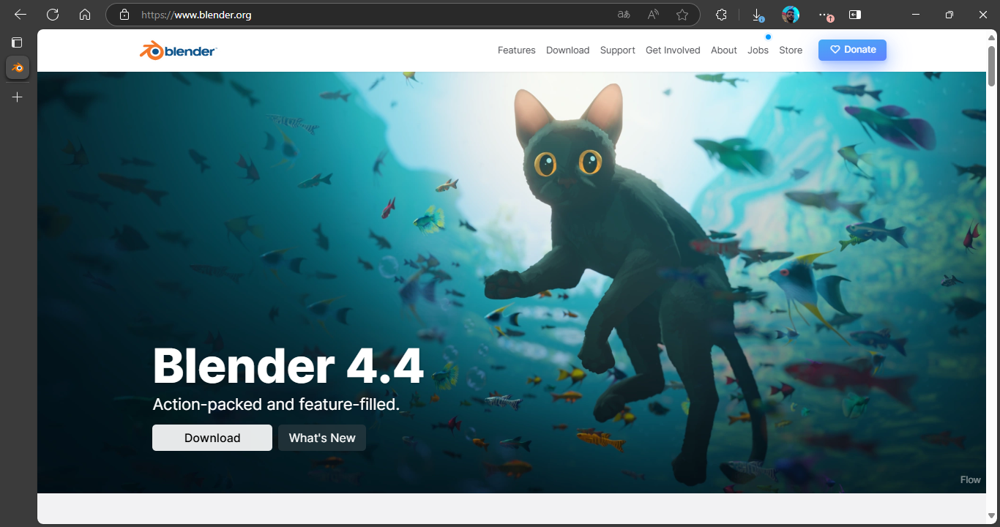
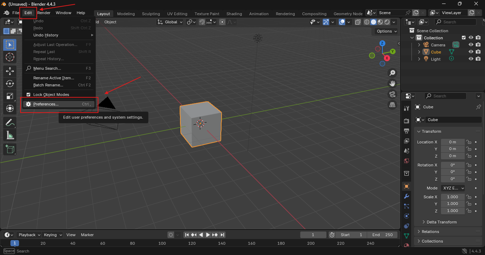
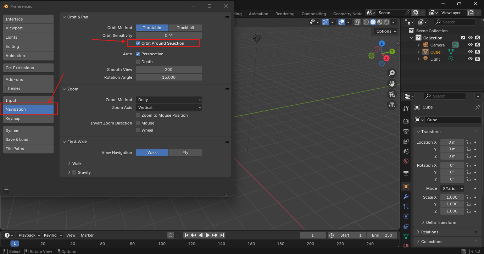
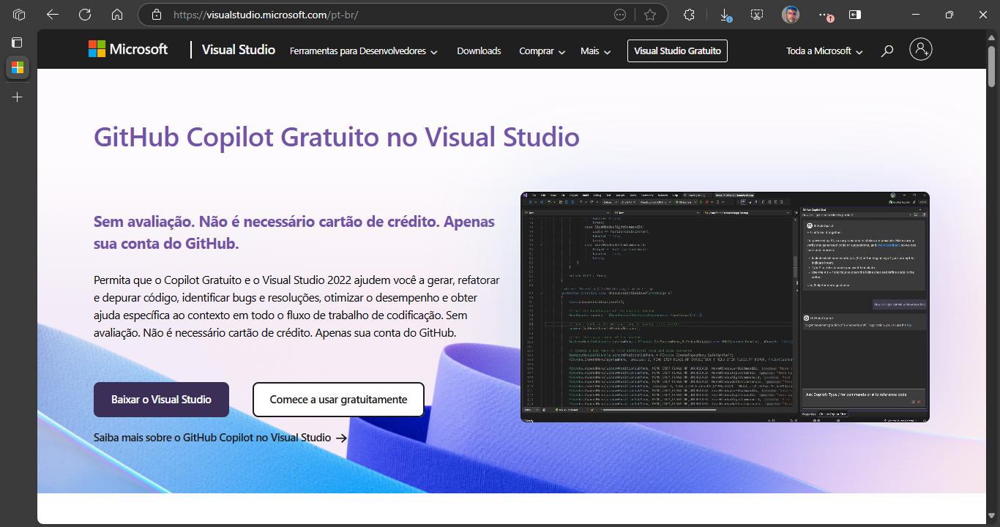
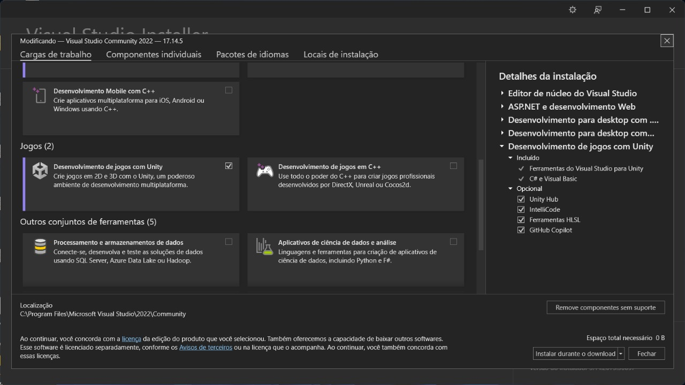
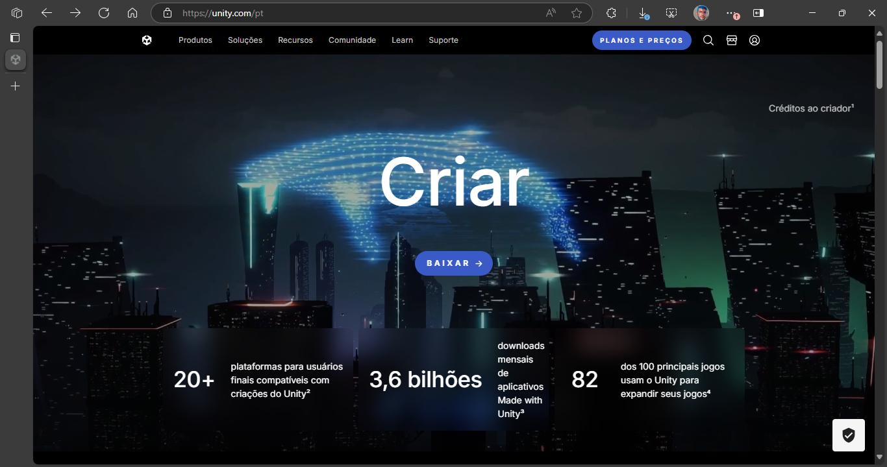
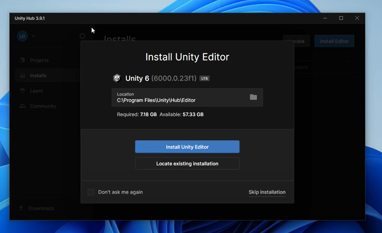
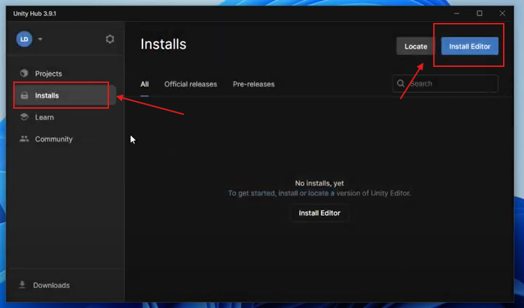
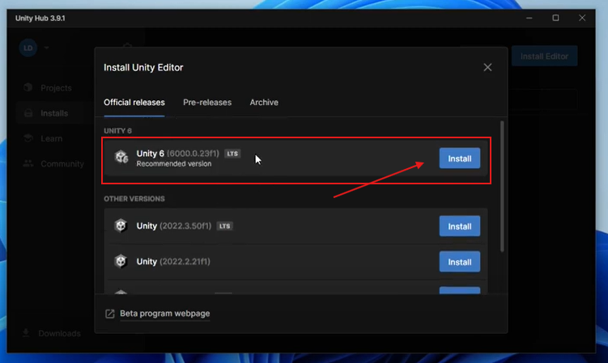

# Requisitos Mínimos
### Blender
- Sistema Operacional: Windows 8.1 ou superior (64-bit).
- Processador: 4 núcleos com suporte a SSE4.2.
- Memória RAM: 8 GB.
- Placa Gráfica: 2 GB de VRAM, OpenGL 4.3.
- Armazenamento: 1 GB de espaço livre. 

### Unity
- Sistema Operacional: Windows 10 (versões de 64 bits), Windows 11.
- Processador: Arquitetura x64 com suporte a instruções SSE2.
- RAM: 8 GB de RAM.
- Placa de vídeo: Compatível com DirectX 10, 11 ou 12.
- Armazenamento: Espaço em disco disponível.

# Instalando as Ferramentas

### 1. Instalando o Blender
1.1. Entre no site do Blender e faça o download da ferramenta. [Click aqui](https://www.blender.org/)

1.2. Após o download é só abrir o instalador e dar next até o fim.

1.3. Este passo é opcional, aqui podemos melhorar um pouco o manuseio da visão ao modelar objetos, isso ajuda os iniciantes.

1.4. Seu Blender está pronto para ser usado! 😎

### 2. Instalando o Visual Studio
2.1. Entre no site do Visual Studio e faça o download da ferramenta. [Click aqui](https://visualstudio.microsoft.com/pt-br/)

2.2. Após o download é só abrir o instalador e dar next até o fim.

2.3. Quando chegar nesta tela, selecione a opção de `Desenvolvimento de Jogos com a Unity` e continue com a intalação.

2.4. Seu Visual Studio está pronto para ser usado! 😎

### 3. Instalando o Unity
3.1. Entre no site do Unity e faça o download da ferramenta. [Click aqui](https://unity.com/pt)

3.2. Após o download é só abrir o instalador e dar next até o fim.

3.3. Abra o Unity Hub e crie uma conta.

3.4 Instale a versão 6, que foi usada no projeto. Caso apareça outra versão você pode apertar em `Skip installation`

3.5 Outra forma de instalar é por esse menu.

3.6 Seu Unity está pronto para ser usado! 😎
